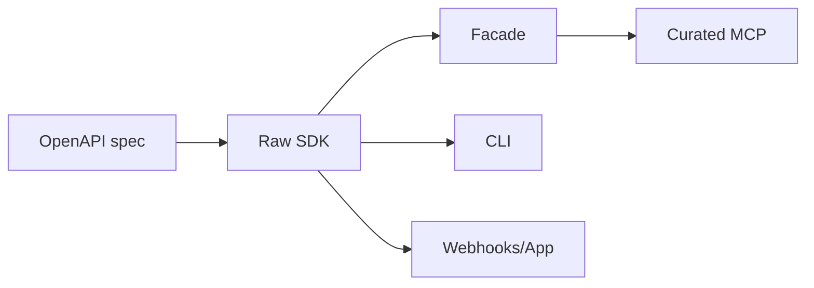

# API Reference

Pumble TypeScript SDK / Developer Toolkit generated with Speakeasy for the Pumble API-Keys add-on.

> **Scope note.** This reference documents the Pumble SDK only. It is not a manual for a general SDK generator — the product boundary is captured in [`docs/product/sdk-generator-product-boundary.md`](../../docs/product/sdk-generator-product-boundary.md).

Redacted release proof for `0.3.21`: [`docs/verification/v0.3.21.md`](docs/verification/v0.3.21.md).
Migration notes: [`docs/MIGRATING.md`](docs/MIGRATING.md).

## Raw SDK

Use the generated SDK when you need direct endpoint coverage.

```ts
import { PumbleSDK } from "pumble-sdk";

const sdk = new PumbleSDK({
  apiKeyAuth: process.env["PUMBLE_API_KEY"]!,
});
```

Raw resource groups:

- `channels`
- `messages`
- `scheduledMessages`
- `users`

Raw SDK methods throw SDK errors.

API-key SDK auth is stable for Node.js applications.



## Facade

Use the facade for application flows that benefit from target resolution,
receipts, and value failures.

```ts
import { createPumbleClient } from "pumble-sdk/extensions/index.js";

const pumble = createPumbleClient({
  apiKeyAuth: process.env["PUMBLE_API_KEY"]!,
});
```

Facade methods:

- `messages.send`
- `messages.dm`
- `scheduled.create`
- `scheduled.list`
- `scheduled.get`
- `scheduled.edit`
- `scheduled.cancel`
- `threads.reply`
- `search.recent`
- `resolvers.preflight`
- `resolvers.clearCache`
- `resolvers.refresh`
- `resolvers.cacheInfo`

Facade request and receipt types enforce branded `ChannelId`, `MessageId`, and
`UserId` values for exact-ID write paths. Raw generated SDK request/response
types still use plain strings; branded IDs are opt-in outside the facade.

Facade result shape:

```ts
type FacadeResult<T> =
  | ({ ok: true; summary: string } & T)
  | { ok: false; reason: string; summary: string; choices: unknown[]; nextActions: string[] };
```

Facade operations return value failures for resolver failures and operation failures.
In short: facade operations return value failures instead of throwing for these cases.
Raw SDK methods throw generated SDK errors. Use `assertFacadeOk(result)` when
application code wants thrown failures from facade results.

## Errors

Raw SDK methods throw SDK errors such as response validation, status, and
transport errors. The facade returns value failures for resolver failures and
API or transport failures.

Use `assertFacadeOk` when a caller wants thrown failures from facade results.
Use `categorizeError` to map thrown raw SDK errors into application categories.

See [`docs/ERRORS.md`](docs/ERRORS.md) for the error model by surface.

```ts
try {
  await sdk.messages.sendMessage({ channelId, text });
} catch (error) {
  const categorized = categorizeError(error);
  console.error(categorized.summary);
}

const result = await pumble.messages.send({ channel: "#ops", text });
if (!result.ok) {
  console.error(result.summary);
}
```

## Pagination

Raw generated pagination is lower level and follows endpoint-specific response
shapes. For search walks, prefer `searchAllMessages`.

`searchAllMessages` is the safer helper for search walks because it manages
timestamp cursors, overlaps same-second boundaries, and dedupes by message ID.
Very high-volume identical timestamp bursts may still require narrower query
windows.

## MCP

The default agent profile is curated:

```bash
pumble-mcp start --transport stdio --profile curated
```

`pumble-mcp start --profile curated` also selects the curated profile with the
local stdio default.

Stdio is the local default transport for MCP clients. SSE binds to `127.0.0.1`
by default and supports optional bearer auth:

```bash
pumble-mcp start --transport sse --host 127.0.0.1 --auth-token "$PUMBLE_MCP_TOKEN"
```

Curated MCP read tools and confirmed-write tools are the stable agent-facing
surface.

Raw readwrite mode is intentionally loud:

```bash
PUMBLE_API_KEY=... pumble-mcp start --transport stdio --profile readwrite --allow-raw-writes --audit-log ./pumble-mcp-audit.jsonl
```

## CLI

The package provides these binaries:

- `pumble`
- `pumble-mcp`

Use `pumble --help` for SDK shell commands and `pumble-mcp start --help` for MCP
transport/profile flags.

Prefer `PUMBLE_API_KEY`, `--api-key-file`, or `--api-key-stdin` over command-line keys.

```bash
export PUMBLE_API_KEY="<pumble-api-key>"
pumble whoami
pumble whoami --api-key-file ~/.config/pumble/api-key
printf '%s\n' "$PUMBLE_API_KEY" | pumble --api-key-stdin whoami
```

## Webhooks

Webhook helpers provide signature verification for signed Pumble callbacks and
an event handler/router surface for dispatching typed events. Keep raw-body
middleware in front of webhook verification routes.

## Stability

| Import path | Surface | Stability |
| --- | --- | --- |
| `pumble-sdk` | Raw SDK | Stable |
| `pumble-sdk/extensions/index.js` | Facade helpers | Stable |
| `pumble-sdk/extensions/webhooks.js` | Webhook verification | Stable |
| Curated MCP stdio/read/confirmed-write tools | Agent tools | Stable |
| `pumble-sdk/extensions/telemetry.js` | Telemetry helpers | Beta |
| Audit-log helpers | Audit-log helpers | Beta |
| `pumble-sdk/extensions/testing/index.js` | Testing/replay helpers | Beta |
| `pumble-sdk/extensions/app/index.js` | App/OAuth helpers | Experimental |
| `pumble-sdk/extensions/app/socket-mode.js` | Socket Mode | Experimental |
| Package split | Future packaging shape | Experimental |
| Generated internals and patch scripts | Generated/runtime maintenance | Internal |

OAuth/app helpers are experimental utilities; they do not provide a complete install, token refresh, storage, and workspace-selection flow.
OAuth/app helpers and Socket Mode are experimental. They do not provide a complete install, token refresh, durable token storage, workspace-selection flow, bundled WebSocket transport, deployment recipe, or live app test suite.

## Release Evidence Checklist

Every release should link or attach:

- OpenAPI spec audit result.
- Generated diff summary.
- Offline verification result.
- Live verification result with redacted output.
- Pack smoke result.
- npm provenance confirmation.
- Changelog entry.
- Known limitations.

## Rate Limits

The built-in rate limiter is process-local. It does not coordinate across workers, serverless instances, containers, or machines.

For distributed deployments, place rate-limit coordination outside the SDK. Use a shared store such as Redis in application code, then call the SDK only after the shared limiter grants a slot. Do not add Redis as a core dependency of `pumble-sdk`.

## OpenTelemetry

OpenTelemetry integration is an optional example, not a core dependency. See `examples/opentelemetry.ts`.

Feedback coverage is recorded in `docs/STABILITY.md`.
